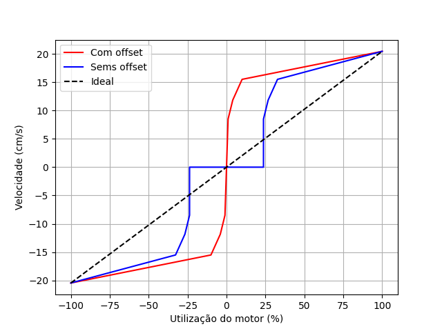
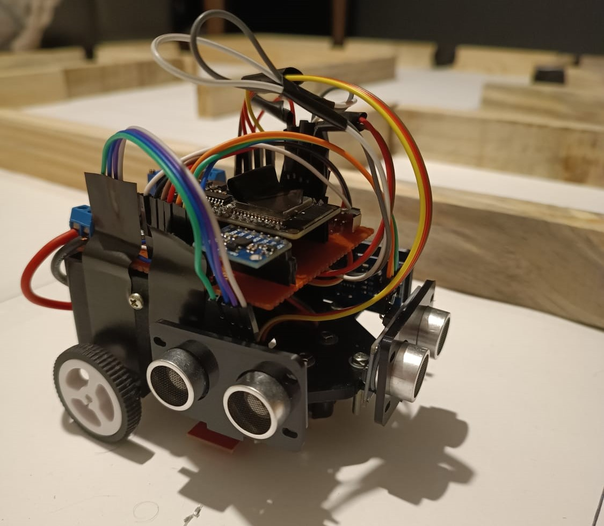

# Projeto Micromouse

Este projeto Micromouse, autônomo, é desenvolvido em simulação (Webots) e experimental (Prático). Inclui implementações de controle PID para orientação, navegação e resolução de labirintos do robô.

## Versões

### Versão 7.4
- Data: 12/12/2023

#### Mudanças

- Código final da disciplina em Eletrônica/Algoritmo Solucionadores/algoritmo_v7
- Nele, ajustes como aplicação de um delta negativo na angulo de virada foi essencial, pois notou-se que o robo virava sistematicamente a mais do que os 90° ou 180° (o que pode ser explicado pela inercia de rotação que ele possui quando esta em movimento), asism, com um delta de 5° as curvas passaram a ser mais precisas e o robo ficou bem mais consistente e responsivo
- Além disso, foi adiciona mais controle derivativa ao controle anticolisão
- De maneira geral, o robo consegue resolver o labirinto (2 x 1.5) inteiro de qualquer posição em aproximadamente 4 min.

### Versão 7.3
- Data: 10/12/2023

#### Mudanças

- Nova simulação do webots com código para correção de curva e novo critério de transição do estado RUN e CURVE. Se houver uma parede quando entrar na curva, chegar perto da parede, mesmo se isso demorar mais do que o delay padrão. Também um algorítmo para estimar uma correção de angulo ao fazer curvas, caso o robô entre torto na curva.

-Código v6 (a testar) correspondente as mudanças simuladas no webots

### Versão 7.2
- Data: 08/12/2023

#### Mudanças

- Codigo v4 (testado), porém o PID muito lerdo, mas tudo funcionando, inclisive a a parada
- Código v5 (não testado), mas com o pwd de 8 bits (antigo), algumas mudanças nos valores de base_speed, PID, parada do robo comentada e tbm travado no anticolisão, além da ida da RUN pro anticolisão se ele identificar parede depois da curve

### Versão 7.1
- Data: 02/12/2023

#### Mudanças

- Foi adicionado ao estado curva o código de redundância pra ver se esta correto mesmo virar ou foi erro de leitura.
- Adicionado a comparação da função do motor conforme a Imagem.
- Atualização do diagrama de estados com a mudança da redundância.
- Adição do código de teste do módulo display 7 segmentos.

.

### Versão 7.0
- Data: 30/11/2023

#### Mudanças

- Integração dos códigos da eletrônica ao controle no robô real.
- Criação da pasta 'algoritmos_solucionadores' dentro da pasta 'eletronicas', contendo três versões. A versão mais avançada implementa os três estados descritos no diagrama de controle.
- Ajustes necessários nos ganhos dos controladores, constantes de tempo do 'run' e ajuste de velocidades.
- O robô ainda não está adaptado para identificar a marca final do labirinto.

.

### Versão 6.2.0.1

- Data: 15/11/2023

#### Mudanças

- Adição de funções para teste de sensor de linha.
- Implementação de uma função para integrar o sensor de linha ao robô.

### Versão 6.1.5.1

- Data: 15/11/2023

#### Mudanças

- Ajustes finos nos parâmetros do temporizador.
- Reorganização do código no maze_solution_algorithm.cpp.
- Atualização do diagrama de estados conforme .

### Versão 6.0.5.1

- Data: 12/11/2023

#### Mudanças

- Adição do algoritmo anticolisão (anti_colision.cpp) que utiliza apenas informações dos sensores ultrassônicos para manter o robô no centro do caminho.
- Integração do algoritmo anticolisão ao algoritmo geral (maze_solution_algorithm.cpp), representado por três estados conforme definido no diagrama de estados .
  - **Anticolisão:** Utiliza informações dos sensores ultrassônicos para manter o robô no centro do caminho. Parte do código também define a direção a ser virada.
  - **Pra Frente:** Parte do código sem controle que faz o robô avançar por um período de tempo determinado.
  - **Virar:** Implementação de PID que utiliza o giroscópio para girar o robô no próprio eixo.

### Versão 5.0.4.0

- Data: 30/10/2023

#### Mudanças

- Novo arquivo world (prototipo1) em que o robô e labirinto funcionam com os controladores disponíveis.
- Criação do .gitignore para que não sejam compartilhados arquivos .exe e da pasta build.

### Versão 4.0
- Data: 25/10/2023

#### Mudanças

- Integração dos algoritmos de orientação e navegação.
- Adaptação do robô para realizar curvas com base nas informações das paredes do labirinto.

### Versão 3.0
- Data: 25/10/2023

#### Mudanças

- Adição dos arquivos de execução do Webots.
- Importação do modelo CAD do Micromouse para o repositório.
- Implementação do algoritmo de navegação baseado na regra da mão esquerda.
- Separação dos algoritmos de orientação e navegação para melhor gerenciamento.

### Versão 2.0
- Data: 24/10/2023

#### Mudanças

- Adição de uma condição para permitir que o Micromouse realize curvas em torno de seu próprio eixo, ajustando os valores do controlador conforme o erro aumenta.

### Versão 1.1
- Data: 24/10/2023

#### Mudanças

- Adição da constante de PI para reduzir o erro na orientação do robô.

### Versão 1.0
- Data: 23/10/2023

#### Algoritmo de Orientação

Nesta versão, implementamos um algoritmo de orientação baseado em controle PID. O robô é capaz de girar para ângulos desejados de forma precisa, tornando-o apto para seguir direções de forma eficaz.

## Como Usar

Para utilizar este projeto, siga as etapas abaixo:

1. Clone o repositório do GitHub em seu ambiente de desenvolvimento.
2. Abra o projeto no Webots e execute o código fornecido no controlador do robô.
3. Observe o comportamento do robô ao seguir direções de forma eficaz com base no controle PID implementado.

## Autores

- Luan Alflen
- Lucas Keller
- Vinicius Carneiro
- Vitor Citelli
- Vitor Lenz
